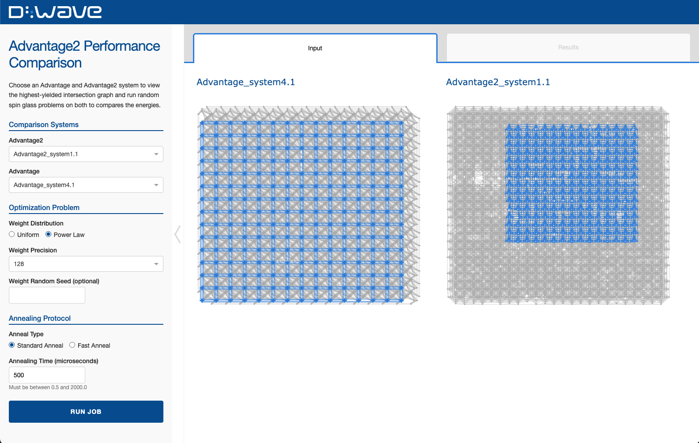

<!-- The following is a README template for your new demo. -->

# Advantage2

This demonstration compares an Advantage2 system to an Advantage system by finding the
highest-yielded intersection graph and comparing energies from 1000 samples on each system. The demo
allows for customization of Advantage and Advantage2 systems, annealing protocol, and weight
distribution and precision.



<!-- Below is boilerplate instructions to be included, as is, in the final demo. -->

## Installation
You can run this example without installation in cloud-based IDEs that support the
[Development Containers specification](https://containers.dev/supporting) (aka "devcontainers")
such as GitHub Codespaces.

For development environments that do not support `devcontainers`, install requirements:

```bash
pip install -r requirements.txt
```

If you are cloning the repo to your local system, working in a
[virtual environment](https://docs.python.org/3/library/venv.html) is recommended.

## Usage
Your development environment should be configured to access the
[Leap&trade; quantum cloud service](https://docs.ocean.dwavesys.com/en/stable/overview/sapi.html).
You can see information about supported IDEs and authorizing access to your Leap account
[here](https://docs.dwavesys.com/docs/latest/doc_leap_dev_env.html).

Run the following terminal command to start the Dash application:

```bash
python app.py
```

Access the user interface with your browser at http://127.0.0.1:8050/.

The demo program opens an interface where you can configure problems and submit these problems to
a solver.

Configuration options can be found in the [demo_configs.py](demo_configs.py) file.

> [!NOTE]\
> If you plan on editing any files while the application is running, please run the application
with the `--debug` command-line argument for live reloads and easier debugging:
`python app.py --debug`

## Problem Description
The Advantage and Advantage2 systems are compared by measuring the energies of 1000 random spin
glass problem samples of customizable weight precision and distribution.


**Advantage2 System:** Choose from a list of Advantage2 systems available through your Leap account.
D-Wave's Advantage2 system features a Zephyr&trade; topology with over 4,400 qubits and 40,000
couplers.

**Advantage System:** Choose from a list of Advantage systems available through your Leap account.

**Weight Distribution:** The strategy for choosing weights.
- Uniform: Generates problem samples where the weights are sampled uniformly.
- Power Law: Generates problem samples where the weights are sampled according to a power law
distribution.

For more information, see the
[documentation](https://docs.dwavequantum.com/en/latest/ocean/api_ref_dimod/generators.html#random)
on generators.

**Weight Precision:** Weights will be chosen between -/+ the precision value, based on the
distribution above.

**Random Seed:** Allows for repeated problem runs by sampling the weights in predictable manner.

**Anneal Type:**
[Standard](https://docs.dwavequantum.com/en/latest/quantum_research/annealing.html#qpu-annealprotocol-standard)
or
[Fast](https://docs.dwavequantum.com/en/latest/quantum_research/annealing.html#qpu-annealprotocol-fast).
Fast anneal enables anneal execution in a coherent regime (when the anneal is fast enough to have
minimal interference from its environment) and thus allows for a larger range of values for the
annealing time.

**Annealing Time:** Measured in microseconds. Setting "Anneal Type" to "Fast" allows for an expanded
range of annealing time values.

## References

"Performance gains in the D-Wave Advantage2 system at the 4,400-qubit scale", 14-1083A-A
(D-Wave Whitepaper, 2025).

## License

Released under the Apache License 2.0. See [LICENSE](LICENSE) file.
